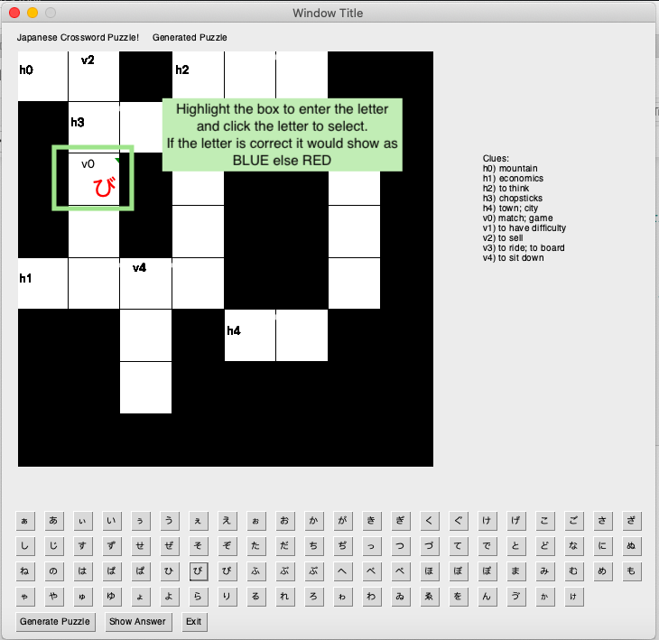

# Japanese Crossword Puzzle

## Overview

### Project summary

Some of us have picked up a hobby of learning new languages during these difficult times. We want to build a tool that can help people learn foreign lanugages, starting by learning the letters and vocabs via crossword puzzles!

[Devpost](https://devpost.com/software/japanese-crossword-puzzle)

### Authors

- **Chin Jung Cheng** - chengcj – chengcj@seas.upenn.edu – [GitHub](https://github.com/chengcj-upenn)
- **Sumit Garg** - sumitga – sumitga@seas.upenn.edu – [GitHub](https://github.com/sumitmcit)

## Usage

The application is launched from Python (main.py). Once launched, a new window will pop up and the user can start clicking the button Generate Puzzle. User will see a new random crossword puzzle generated and can start solving it by selecting the tile on the puzzle and click the correct japanese character for that tile. If it is incorrect, it will show as red. User can also display the answer if they are stuck. A new random puzzle is generated every time the Generate Puzzle button is clicked.

### Prerequisites

New users will require Python3.8 to execute main.py in their console

### Installation

To **install** the project, you need to open a shell to perform the following steps

Step 1.

```
git clone https://github.com/chengcj-upenn/jp_crossword_puzzle.git
```

Step 2.

```
python -m pip install pysimplegui
python -m pip install numpy
```

### Deployment

From your console, change directory to the git cloned directory. After than execute the following:

```
python main.py
```

After executing the command, a new window will appear. The user can click the button Generate Puzzle. User will see a new random crossword puzzle generated and can start solving it by selecting the tile on the puzzle and click the correct japanese character for that tile. If it is incorrect, it will show as red. User can also display the answer if they are stuck. A new random puzzle is generated every time the Generate Puzzle button is clicked.





## Additional information

### Tools used

Which frameworks, libraries, or other tools did you use to create your project?

- [PySimpleGUI](https://pysimplegui.readthedocs.io/en/latest/) - Frontend

### Acknowledgments

- Japanese vocab JSON file: https://raw.githubusercontent.com/cemulate/genki-db/master/src/assets/vocab.json
